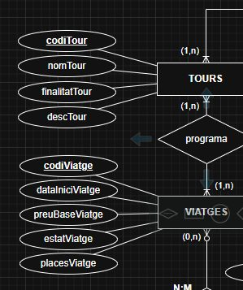
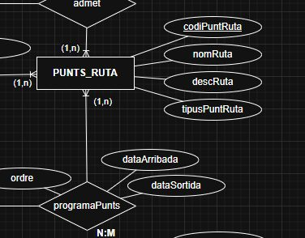
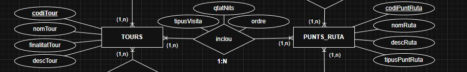
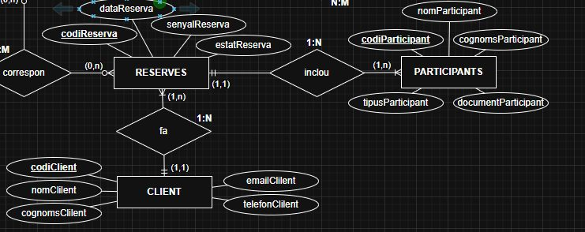
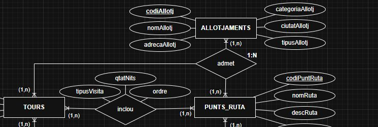
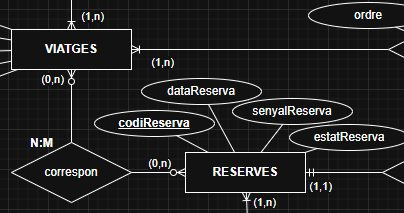
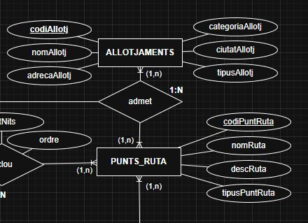
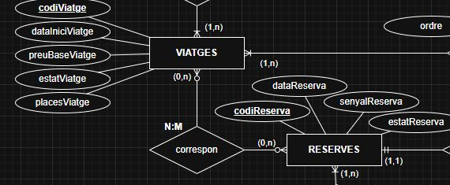
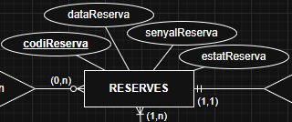

# Informe de correcció GRUP 2

- Timestamp: `2025-11-10T11:03:19.473Z`
- Activitat: `validacio-mer-agencia`
- Compleció: **100.0%**
- Respostes correctes: **9/10**
- Escenaris amb discrepància: **3**

## Detall per escenari
### Escenari 1
- Resposta equip: **Sí** · Esperat: **Sí** ✅
- Text o imatge a 'On ...': Sí
  - **Imatge aportada:**

  

  - **Justificació:**
  > Se puede modelar porque un tour puede tener varios viajes (1:N).
  > Pero también puede ser relación (1,1) si los viajes solo pueden ser programados por un único tour.

### Escenari 2
- Resposta equip: **Sí** · Esperat: **Sí** ✅
- Text o imatge a 'On ...': Sí
  - **Imatge aportada:**

  

  - **Justificació:**
  > La relación es N:M porque varios viajes pueden tener varias fechas de llegada, salida y diferente orden

### Escenari 3
- Resposta equip: **Sí** · Esperat: **No** ❌
- Text o imatge a 'On ...': Sí
  - **Imatge aportada:**

  

  - **Justificació:**
  > Se puede modelar porque un punto de ruta (Roma) puede tener un o varios tours asignados (1,n), y un tour puede tener varios puntos de ruta asignados.

### Escenari 4
- Resposta equip: **Sí** · Esperat: **Sí** ✅
- Text o imatge a 'On ...': Sí
  - **Imatge aportada:**

  

  - **Justificació:**
  > Hay 3 entidades, CLIENTS, RESERVES Y PARTICIPANTS. Una reserva solo puede tener un unico cliente, pero puede tener varios participantes. Los participantes solo pueden tener una reserva, pero un cliente puede tener varias reservas.

### Escenari 5
- Resposta equip: **No** · Esperat: **No** ✅
- Text o imatge a 'On ...': Sí
  - **Imatge aportada:**

  

  - **Justificació:**
  > La relación sería (0:n), ya que el punto de ruta y el tour pueden existir sin los alojamientos (hotel), pero estos no pueden existir sin un tour o un punto de ruta

### Escenari 6
- Resposta equip: **No** · Esperat: **No** ✅
- Text o imatge a 'On ...': Sí
  - **Imatge aportada:**

  

  - **Justificació:**
  > No se puede modelar, porque no puede haber más de un viaje en una misma reserva, en todo caso serían reservas distintas (aunque sea del mismo cliente).

### Escenari 7
- Resposta equip: **Sí** · Esperat: **Sí** ✅
- Text o imatge a 'On ...': Sí
  - **Imatge aportada:**

  

  - **Justificació:**
  > Se puede hacer el modelo MER, pero la relación Alojamiento-Punto de ruta es (1,1) porque un alojamiento solo puede estar asignado a un punto de ruta

### Escenari 8
- Resposta equip: **Sí** · Esperat: **Sí** ✅
- Text o imatge a 'On ...': Sí
  - **Imatge aportada:**

  

  - **Justificació:**
  > Si se puede modelar porque, a pesar de ser dos reservas para el mismo viaje, cada reserva tendrá su código de reserva único.

### Escenari 9
- Resposta equip: **No** · Esperat: **No** ✅
- Text o imatge a 'On ...': Sí
  - **Imatge aportada:**

  

  - **Justificació:**
  > No se puede modelar, porque el alojamiento esta asignado a un punto de ruta, que a su vez está asignado a un viaje, y no a un cliente. Y al revés, un cliente no tiene asignado ningún alojamiento en sui reserva.

### Escenari 10
- Resposta equip: **Sí** · Esperat: **Sí** ✅
- Text o imatge a 'On ...': Sí
  - **Imatge aportada:**

  

  - **Justificació:**
  > Se puede modelar, porque dentro de la entidad Reserva existen los atributos de señal, y el estado de la reserva, además de la fecha de la reserva.
