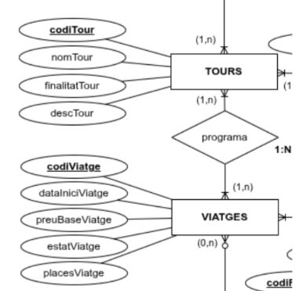
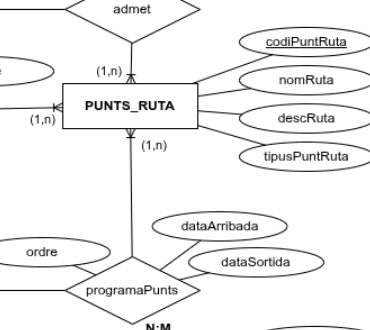
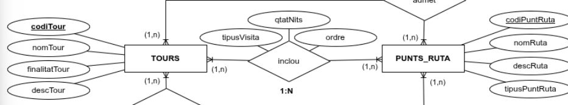
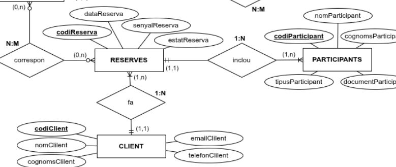
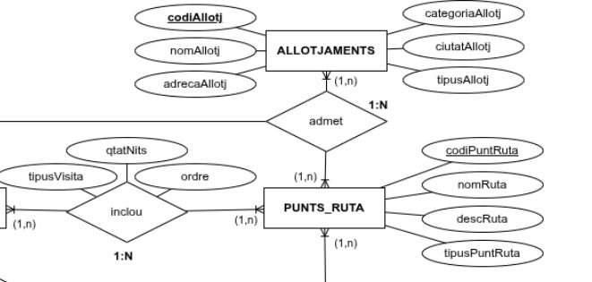
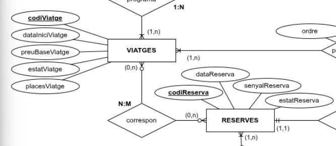
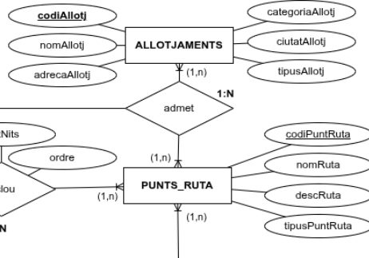
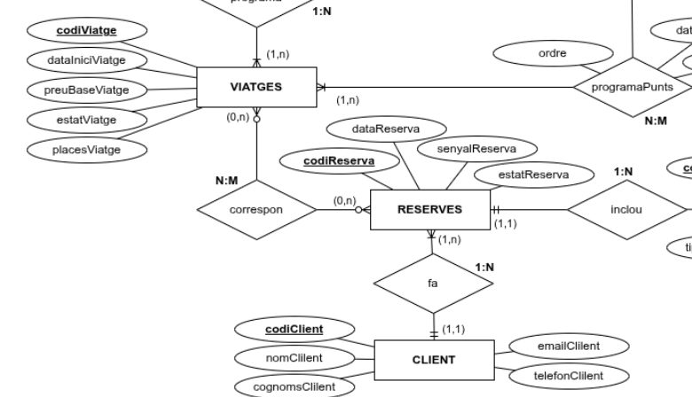
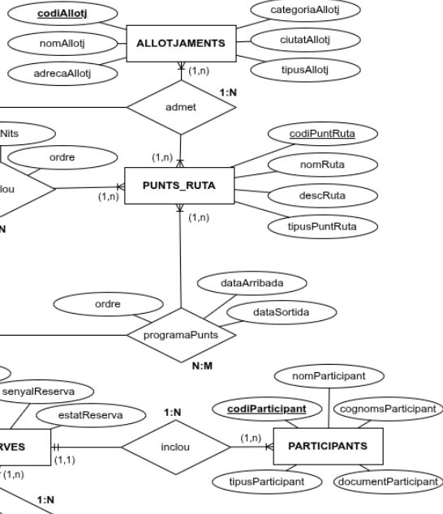
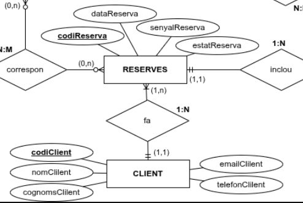

# Informe de correcció GRUP 3

- Timestamp: `2025-11-10T11:03:25.786Z`
- Activitat: `validacio-mer-agencia`
- Compleció: **100.0%**
- Respostes correctes: **8/10**
- Escenaris amb discrepància: **3, 6**

## Detall per escenari
### Escenari 1
- Resposta equip: **Sí** · Esperat: **Sí** ✅
- Text o imatge a 'On ...': Sí
  - **Imatge aportada:**

  

  - **Justificació:**
  > Se puede modelar, pero la relación entre tour y viajes esta mal, debería ser N:M ya que un tour puede tener muchos viajes y un viaje puede pertenecer a  muchos tours como indican las flechas de relación (1,n).

### Escenari 2
- Resposta equip: **Sí** · Esperat: **Sí** ✅
- Text o imatge a 'On ...': Sí
  - **Imatge aportada:**

  

  - **Justificació:**
  > Se puede modelar porque la relación "programaPunts" establece todos los puntos y dentro de "Punts-Ruta" se establece el punto de ruta.

### Escenari 3
- Resposta equip: **Sí** · Esperat: **No** ❌
- Text o imatge a 'On ...': Sí
  - **Imatge aportada:**

  

  - **Justificació:**
  > Roma es un punto de ruta y "grandes capitales romanas" e "Italia esencial" son tours, el MER establece que un punto de ruta puede pertenecer a muchos tours (1,n). (La nomenclatura de inclou debería ser N:M)

### Escenari 4
- Resposta equip: **Sí** · Esperat: **Sí** ✅
- Text o imatge a 'On ...': Sí
  - **Imatge aportada:**

  

  - **Justificació:**
  > Se puede moldear porque existen 3 entidades "RESERVES", "PARTICIPANTS" Y "CLIENT". El MER dice que un cliente puede hacer muchas reservas(1,n), pero que una reserva solo pude ser hecha por un cliente(1,1) y además una reserva puede incluir a muchos participantes y que un participante solo pueda estar en una reserva.

### Escenari 5
- Resposta equip: **No** · Esperat: **No** ✅
- Text o imatge a 'On ...': Sí
  - **Imatge aportada:**

  

  - **Justificació:**
  > No se puede moldear porque dentro del grafico, no se incluye una relación (0,n) que nos permita saber que bien una persona puede tener un alojamiento o siemplemente NO.

### Escenari 6
- Resposta equip: **Sí** · Esperat: **No** ❌
- Text o imatge a 'On ...': Sí
  - **Imatge aportada:**

  

  - **Justificació:**
  > Porque el MER indica que un Viaje puede tener 0 o muchas reservas, cuando en realidad una reserva siempre debería tener asignado un viaje, de otra manera no existiría. entonces la relacion reserva --> viajes debería ser (1,n).

### Escenari 7
- Resposta equip: **Sí** · Esperat: **Sí** ✅
- Text o imatge a 'On ...': Sí
  - **Imatge aportada:**

  

  - **Justificació:**
  > Es correcto ya que un punto de ruta, en este caso Roma, puede tener uno o mas alojamientos, indicándose bajo la entidad alojamientos con (1,n).

### Escenari 8
- Resposta equip: **Sí** · Esperat: **Sí** ✅
- Text o imatge a 'On ...': Sí
  - **Imatge aportada:**

  

  - **Justificació:**
  > El hecho de que codigo de reserva sea el "primary key" hace posible que la relación entre cliente y viajes sea de (1,n) porque de esta manera las reservas se guardan con diferentes codigos.
  > una reserva puede tener uno o muchos viajes asignados y viceversa.

### Escenari 9
- Resposta equip: **No** · Esperat: **No** ✅
- Text o imatge a 'On ...': Sí
  - **Imatge aportada:**

  

  - **Justificació:**
  > No es moldeable porque los "participantes" deberían tener una relación directa con "puntos de ruta" o con alojamientos y en el MER no la hay.

### Escenari 10
- Resposta equip: **Sí** · Esperat: **Sí** ✅
- Text o imatge a 'On ...': Sí
  - **Imatge aportada:**

  

  - **Justificació:**
  > Si se puede ya que esos atributos se encuentran dentro de la entidad Reservas.
