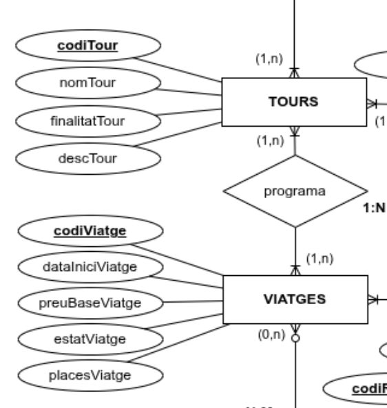
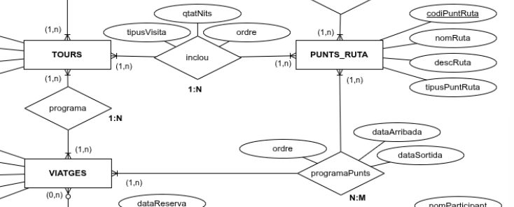
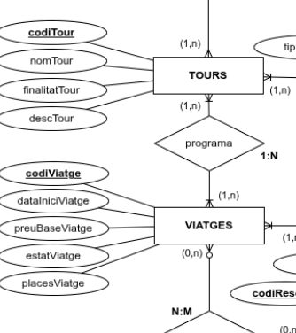
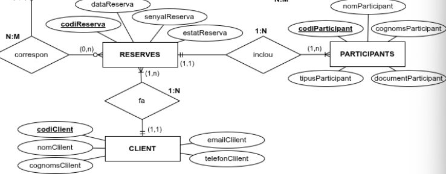
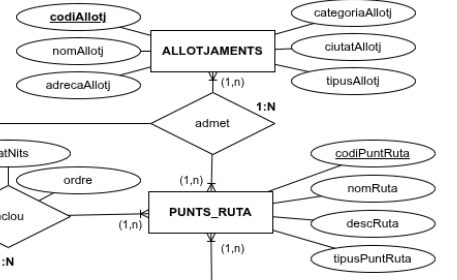
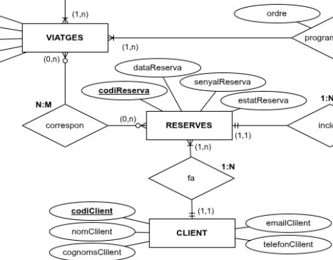
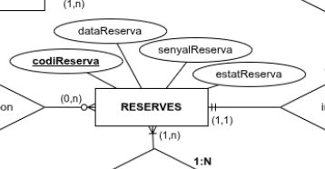

# Informe de correcció GRUP 4

- Timestamp: `2025-11-11T09:03:22.088Z`
- Activitat: `validacio-mer-agencia`
- Compleció: **100.0%**
- Respostes correctes: **8/10**
- Escenaris amb discrepància: **3, 5**


## Detall per escenari
### Escenari 1
- Resposta equip: **Sí** · Esperat: **Sí** ✅
- Text o imatge a 'On ...': Sí
  - **Imatge aportada:**

  

  - **Justificació:**
  > Un tour pot programar diversos viatges en dates diferents i cada viatge pertany a un únic tour; per això és una 1:N. EXTRA: Si volguéssim tours en esborrany sense viatges, el mínim a TOURS passaria a 0..n.

### Escenari 2
- Resposta equip: **Sí** · Esperat: **Sí** ✅
- Text o imatge a 'On ...': Sí
  - **Imatge aportada:**

  

  - **Justificació:**
  > El diagrama mostra una relació entre VIATGES i PUNTS_RUTA anomenada "programaPunts", amb cardinalitat 1:N, que permet definir diversos punts dins una ruta.

### Escenari 3
- Resposta equip: **Sí** · Esperat: **No** ❌
- Text o imatge a 'On ...': Sí
  - **Imatge aportada:**

  

  - **Justificació:**
  > El diagrama mostra que els TOURS es relacionen amb els VIATGES mitjançant la relació "programa" (1:N).
  > VIATGES es relacionen amb PUNTS_RUTA mitjançant "programaPunts" (1:N).
  > Això implica que diversos TOURS poden compartir un mateix VIATGE.

### Escenari 4
- Resposta equip: **Sí** · Esperat: **Sí** ✅
- Text o imatge a 'On ...': Sí
  - **Imatge aportada:**

  

  - **Justificació:**
  > El diagrama mostra que les RESERVES es relacionen amb CLIENT mitjançant la relació "fa", indicant qui fa la reserva.
  > RESERVES es relaciona amb PARTICIPANTS mitjançant la relació "inclou", amb cardinalitat 1:N.
  > Això permet que el client Joan faci la reserva.

### Escenari 5
- Resposta equip: **Sí** · Esperat: **No** ❌
- Text o imatge a 'On ...': Sí
  - **Imatge aportada:**

  

  - **Justificació:**
  > El diagrama mostra que els PUNTS_RUTA es relacionen amb els ALLOTJAMENTS mitjançant la relació "admet", amb cardinalitat (1,N). Això significa que un punt de ruta ha de tenir un allotjament associat.

### Escenari 6
- Resposta equip: **No** · Esperat: **No** ✅
- Text o imatge a 'On ...': Sí
  - **Text aportat:**

```
No hi ha suficient informació per modelar l'escenari.
```

  - **Justificació:**
  > Com el diagrama indica, cada RESERVA esta asignada a un VIATGE, això vol dir que impedeix la posibilitat de que una RESERVA englobi dos VIATGES.

### Escenari 7
- Resposta equip: **Sí** · Esperat: **Sí** ✅
- Text o imatge a 'On ...': Sí
  - **Imatge aportada:**

  

  - **Justificació:**
  > El diagrama mostra una relació "admet" entre PUNTS_RUTA i ALLLOTAMENTS, amb cardinalitat (1,N).
  > Això significa que un punt de ruta com Roma pot admetre diversos allotjaments.
  > Per tant, és totalment viable que Hotel A i Hotel B estiguin disponibles per al mateix punt.

### Escenari 8
- Resposta equip: **Sí** · Esperat: **Sí** ✅
- Text o imatge a 'On ...': Sí
  - **Imatge aportada:**

  

  - **Justificació:**
  > El diagrama mostra que CLIENT es relaciona amb RESERVES mitjançant la relació "correspon", amb cardinalitat 1:N. Això vol dir que un mateix client pot fer diverses reserves a més,cada reserva s’associa a un únic viatge. Per tant, pot fer dues reserves separades per al mateix viatge V1. El model no imposa cap restricció que impedeixi que un client repeteixi reserves per al mateix viatge.

### Escenari 9
- Resposta equip: **No** · Esperat: **No** ✅
- Text o imatge a 'On ...': Sí
  - **Text aportat:**

```
No hi ha suficient informació per modelar l'escenari.
```

  - **Justificació:**
  > En el diagrama no mostra cap relació entre els CLIENTS i el ALLOTJAMENT, cosa que ens nega l'informació d'on dorm cadascú i en quin hotel. Per poder saber-ho hauriem de crear una nova entitat que els relacionès.

### Escenari 10
- Resposta equip: **Sí** · Esperat: **Sí** ✅
- Text o imatge a 'On ...': Sí
  - **Imatge aportada:**

  

  - **Justificació:**
  > El diagrama mostra que l'entitat RESERVA poseeix de varis atributs que com "senyalReserva", "dataReserva", "estatReserva" per cumplir el objectiu del Escenari que és registrar una data mitjançant una senyal.
