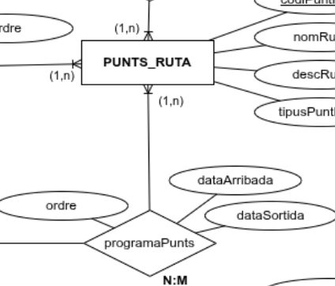
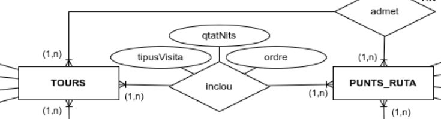
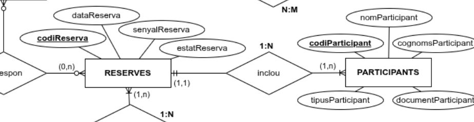
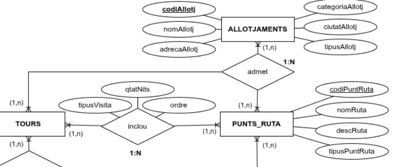
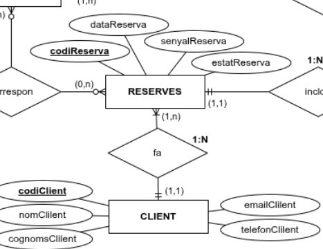
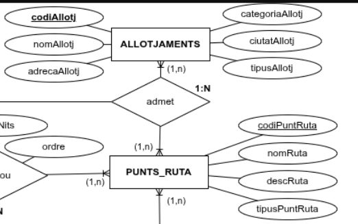
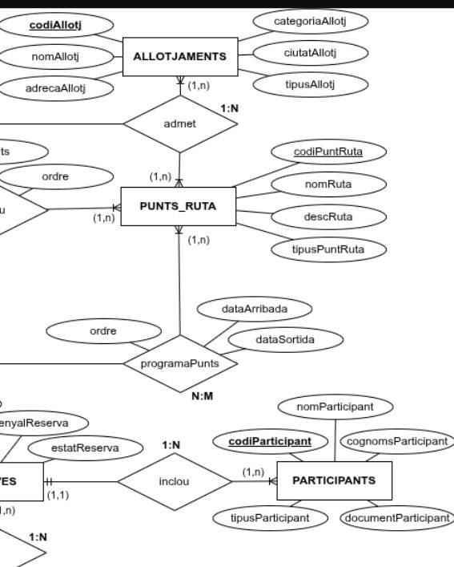
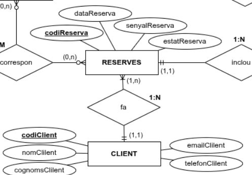

# Informe de correcció GRUP 5

- Timestamp: `2025-11-10T10:58:03.747Z`
- Activitat: `validacio-mer-agencia`
- Compleció: **100.0%**
- Respostes correctes: **9/10**
- Escenaris amb discrepància: **3**

## Detall per escenari
### Escenari 1
- Resposta equip: **Sí** · Esperat: **Sí** ✅
- Text o imatge a 'On ...': Sí
  - **Imatge aportada:**

  

  - **Justificació:**
  > Un tour pot programar diversos viatges en dates diferents i cada viatge pertany a un únic tour; per això és una 1:N. EXTRA: Si volguéssim tours en esborrany sense viatges, el mínim a TOURS passaria a 0..n.

### Escenari 2
- Resposta equip: **Sí** · Esperat: **Sí** ✅
- Text o imatge a 'On ...': Sí
  - **Imatge aportada:**

  

  - **Justificació:**
  > si que es pot perquè el punt de ruta es equivalent a 1 o més tours, i els punts de ruta tenen les dades d'ordre, arribada y sortida.

### Escenari 3
- Resposta equip: **Sí** · Esperat: **No** ❌
- Text o imatge a 'On ...': Sí
  - **Imatge aportada:**

  

  - **Justificació:**
  > un mateix punt ruta pot estar inclos en multiples tours, permetent que Roma aparegui tant en "Itàlia Essencial" com en "Grans Capitals Romanes"

### Escenari 4
- Resposta equip: **Sí** · Esperat: **Sí** ✅
- Text o imatge a 'On ...': Sí
  - **Imatge aportada:**

  

  - **Justificació:**
  > si que es pot representar perquè les reserves inclouen participants de la reserva

### Escenari 5
- Resposta equip: **No** · Esperat: **No** ✅
- Text o imatge a 'On ...': Sí
  - **Imatge aportada:**

  

  - **Justificació:**
  > no es pot, perquè la relació entre punt de ruta i allotjaments té com a opció mínima un allotjament o més per punt de ruta

### Escenari 6
- Resposta equip: **No** · Esperat: **No** ✅
- Text o imatge a 'On ...': Sí
  - **Imatge aportada:**

  

  - **Justificació:**
  > no es pot perquè la reserva es feta per 1 o molts clients, pero un client només pot tenir opció a una reserva.

### Escenari 7
- Resposta equip: **Sí** · Esperat: **Sí** ✅
- Text o imatge a 'On ...': Sí
  - **Imatge aportada:**

  

  - **Justificació:**
  > si es pot, perquè segons la cardinalitat poden admetre diversos allotjaments per punt de ruta

### Escenari 8
- Resposta equip: **Sí** · Esperat: **Sí** ✅
- Text o imatge a 'On ...': Sí
  - **Imatge aportada:**

  

  - **Justificació:**
  > si es pot perquè un client pot fer ninguna o moltes reserves de viatges diferentes segons les cardinalitats

### Escenari 9
- Resposta equip: **No** · Esperat: **No** ✅
- Text o imatge a 'On ...': Sí
  - **Imatge aportada:**

  

  - **Justificació:**
  > perquè no hi ha cap relació que vinculi els participants amb l'allotjament de manera específica.

### Escenari 10
- Resposta equip: **Sí** · Esperat: **Sí** ✅
- Text o imatge a 'On ...': Sí
  - **Imatge aportada:**

  

  - **Justificació:**
  > si que es pot fer perquè els atributs "senyalReserva" i "dataReserva" són camps que s'omplen quan un client vol fer una reserva
